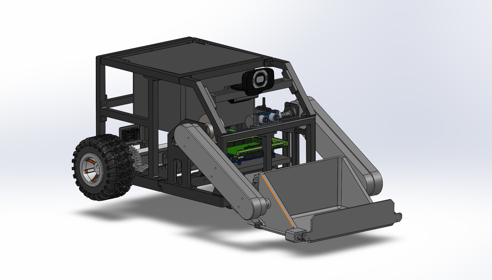
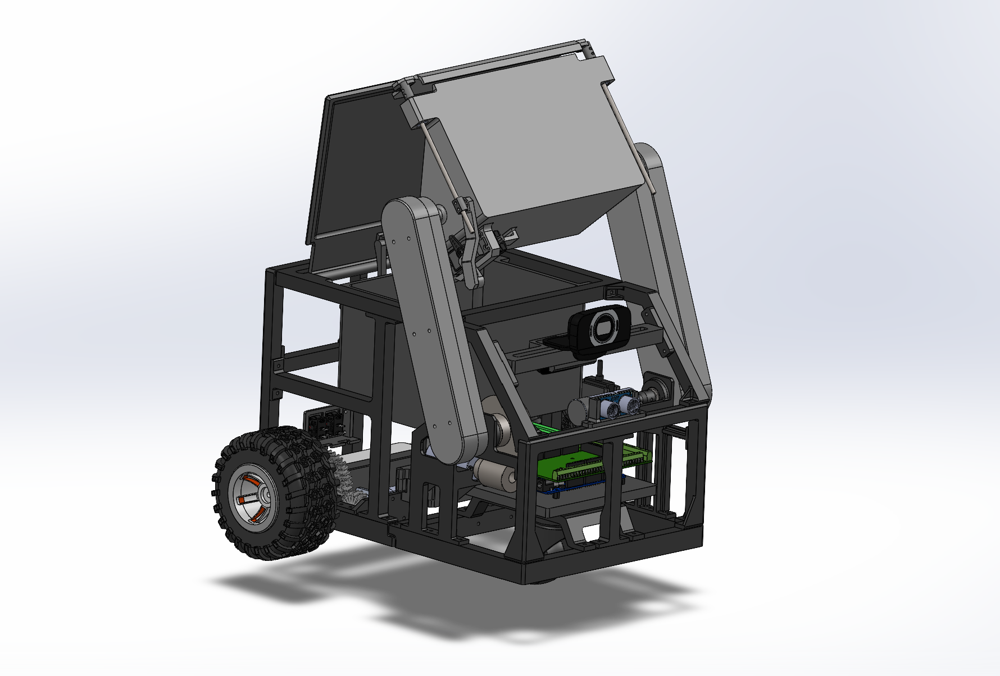
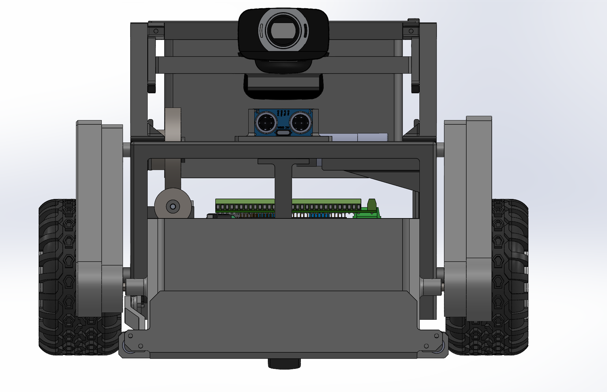
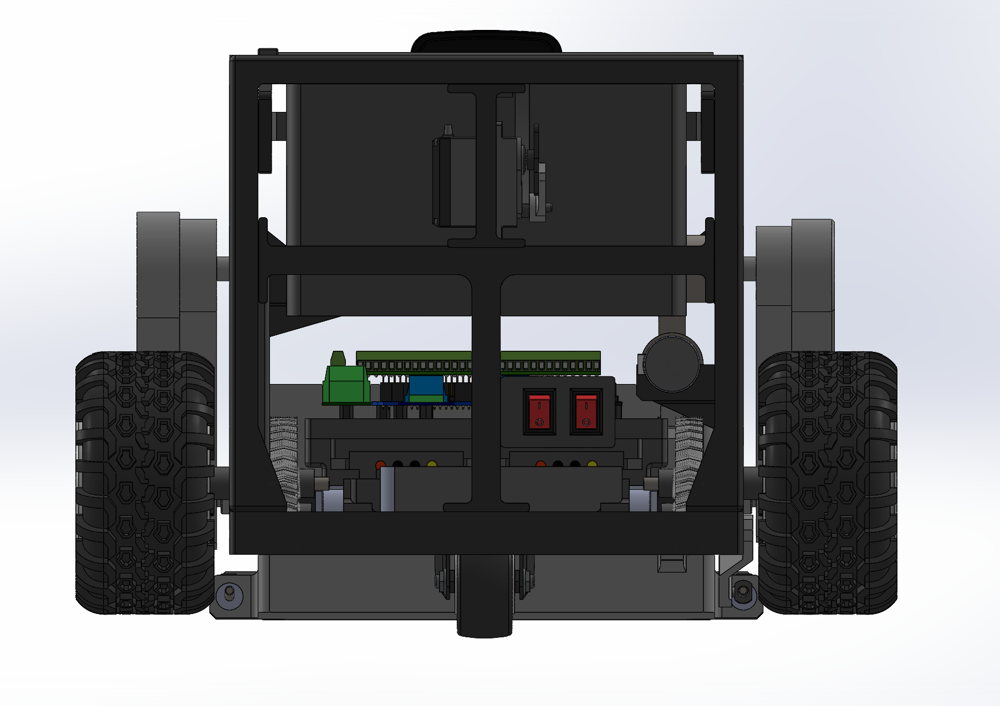
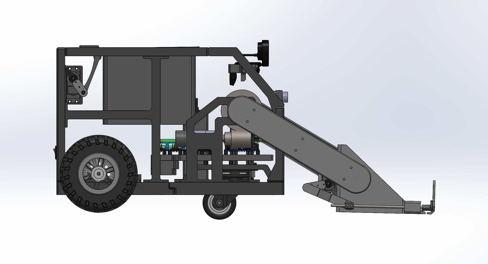
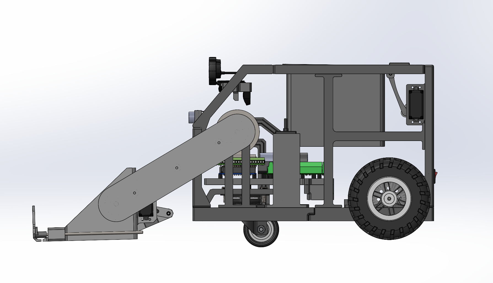

# Autonomous Pet Waste Collection Robot (APWCR)

This repository contains the mechanical design files, analysis, and documentation for the Autonomous Pet Waste Collection Robot project. The contents represent the current state of the CAD assembly and supporting engineering work.

---

## CAD Assembly Views

The following images show the current integrated CAD assembly from multiple standard viewpoints.

### Retreival State Isometric View


### Depositing State Isometric View


### Front View


### Rear View


### Side View



---

## Repository Structure

```
├── 3mf_files/
├── Analysis/
├── Engineering_Drawings/
├── images/
├── mobile_robot_platform_assy/
├── waste_collection_mech_assy/
├── APWCR_Integrated_Assy.SLDASM
└── README.md
```

`3mf_files/`

Contains .3mf files used for 3D printing prototype components.

`Analysis/`

Contains Excel spreadsheets documenting engineering calculations. This includes required motor torque calculations for both the drivetrain and the waste collection mechanism.

`Engineering_Drawings/`

Contains mechanical drawings for manufactured and machined components.

`images/`

Contains rendered CAD images and screenshots used for documentation and design reviews.

`mobile_robot_platform_assy/`

Contains SolidWorks assembly and part files for the mobile robot platform, including drivetrain and structural components.

`waste_collection_mech_assy/`

Contains SolidWorks assembly and part files for the waste collection mechanism.

`APWCR_Integrated_Assy.SLDASM`

Top-level SolidWorks assembly integrating the mobile robot platform and the waste collection subsystems.
